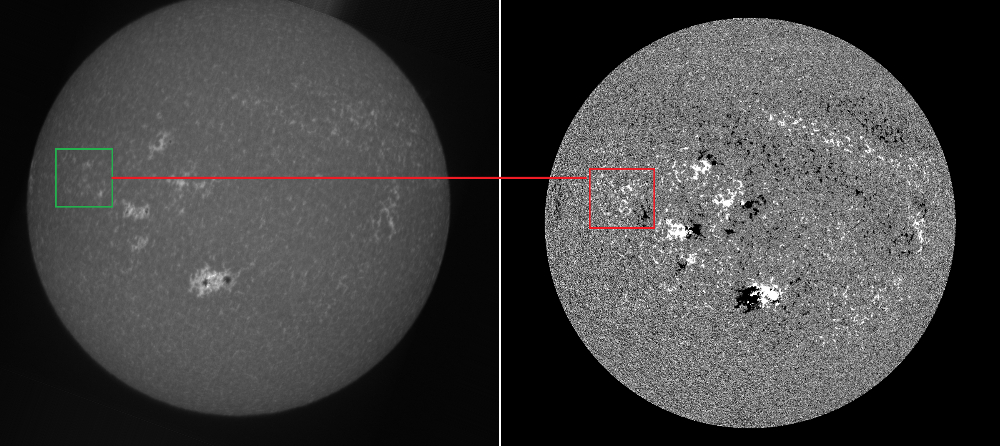

# MSLabel

MSLabel for bounding box lebelling multi-spectral (multi-layer, and possibly time series) imagry.
This tool is useful when visual inspection of two bands, simultanously, is required to create labels. For example, in the figure below, we can visually inspect the right hand side image (image from band 2 that temporally corrosponds/associates with the inspected/target image from band 1) to annotate the target image from band 1 (target band).




```
Assumes dir tree as follows:
   images/band1/band_1_image_1.png, band_1_image_2.png, band_1_image_3.png, etc..
   images/band2/band_2_image_1.png, band_2_image_2.png, band_2_image_3.png, etc..
```


**Please cite: [MLMT-CNN - Object Detection and Segmentation in Multi-layer and Multi-spectral images](https://doi.org/10.1007/s00138-021-01261-y) and [Active Region Detection in Multi-spectral Solar Images](https://www.scitepress.org/Link.aspx?doi=10.5220/0010310504520459) and [MSMT-CNN for Solar Active Region Detection with Multi-Spectral Analysis](https://doi.org/10.1007/s42979-022-01088-y)**


For the object deteciton (bbox based) implementation, please refer to: [Active Region Detection in Multi-spectral Solar Images](https://www.scitepress.org/Link.aspx?doi=10.5220/0010310504520459)
and [repo](https://github.com/MjdMahasneh/Active_Region_Detection_in_Multi-spectral_Solar_Images)
For object detection and segmentation integrated stages (MLMT), please refer to: [MLMT](https://github.com/MjdMahasneh/MLMT-CNN-for-object-detection-and-segmentation-in-multi-layer-and-multi-spectral-images)
